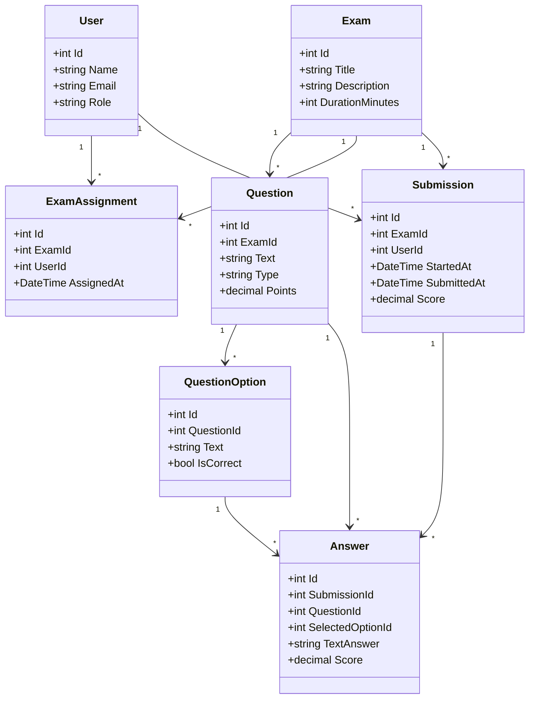

# Diagrama de clases

```mermaid
classDiagram
    class User {
        +int Id
        +string Name
        +string Email
        +string Role
    }

    class Exam {
        +int Id
        +string Title
        +string Description
        +int DurationMinutes
    }

    class Question {
        +int Id
        +int ExamId
        +string Text
        +string Type
        +decimal Points
    }

    class QuestionOption {
        +int Id
        +int QuestionId
        +string Text
        +bool IsCorrect
    }

    class ExamAssignment {
        +int Id
        +int ExamId
        +int UserId
        +DateTime AssignedAt
    }

    class Submission {
        +int Id
        +int ExamId
        +int UserId
        +DateTime StartedAt
        +DateTime SubmittedAt
        +decimal Score
    }

    class Answer {
        +int Id
        +int SubmissionId
        +int QuestionId
        +int SelectedOptionId
        +string TextAnswer
        +decimal Score
    }

    User "1" --> "*" ExamAssignment
    User "1" --> "*" Submission

    Exam "1" --> "*" Question
    Exam "1" --> "*" ExamAssignment
    Exam "1" --> "*" Submission

    Question "1" --> "*" QuestionOption
    Question "1" --> "*" Answer

    Submission "1" --> "*" Answer
    QuestionOption "1" --> "*" Answer
```