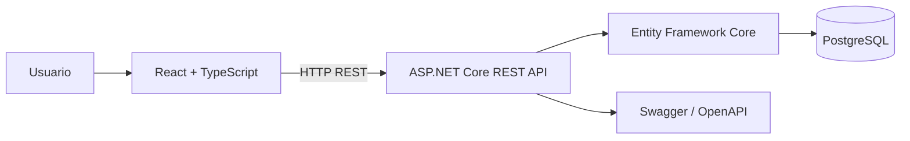

# Diagrama de componentes

```mermaid
flowchart LR
    U[Usuario]
    FE[React + TypeScript]
    API[ASP.NET Core REST API]
    EF[Entity Framework Core]
    DB[(PostgreSQL)]
    SW[Swagger / OpenAPI]

    U --> FE
    FE -->|HTTP REST| API
    API --> EF
    EF --> DB
    API --> SW
```