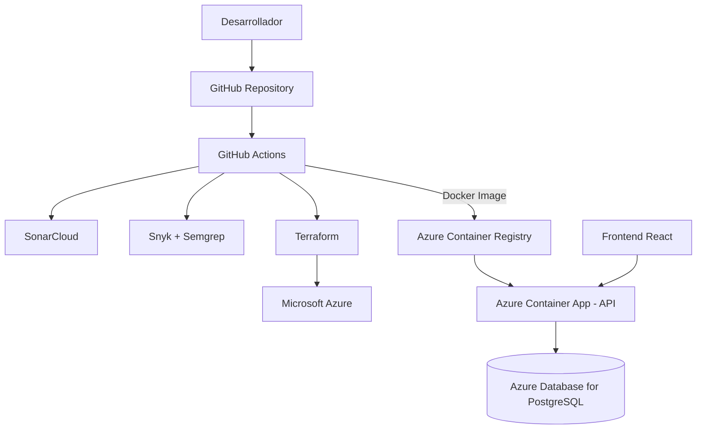

# Diagrama de despliegue

```mermaid
flowchart TB
    DEV[Desarrollador]
    GH[GitHub Repository]
    GA[GitHub Actions]
    SONAR[SonarCloud]
    SECURITY[Snyk + Semgrep]
    TF[Terraform]
    AZURE[Microsoft Azure]
    ACR[Azure Container Registry]
    APP[Azure Container App - API]
    DB[(Azure Database for PostgreSQL)]
    FE[Frontend React]

    DEV --> GH
    GH --> GA

    GA --> SONAR
    GA --> SECURITY
    GA --> TF

    TF --> AZURE

    GA -->|Docker Image| ACR
    ACR --> APP

    APP --> DB
    FE --> APP
```