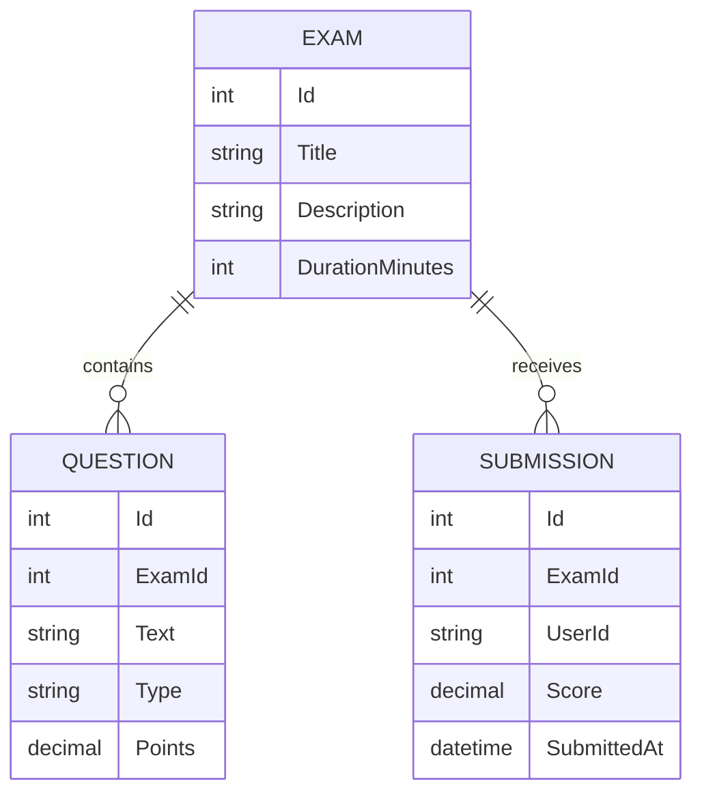

# Diagrama entidad-relación

```mermaid
erDiagram
  EXAM ||--o{ QUESTION : contains
  EXAM ||--o{ SUBMISSION : receives
  EXAM { int Id string Title string Description int DurationMinutes }
  QUESTION { int Id int ExamId string Text string Type decimal Points }
  SUBMISSION { int Id int ExamId string UserId decimal Score datetime SubmittedAt }
```
