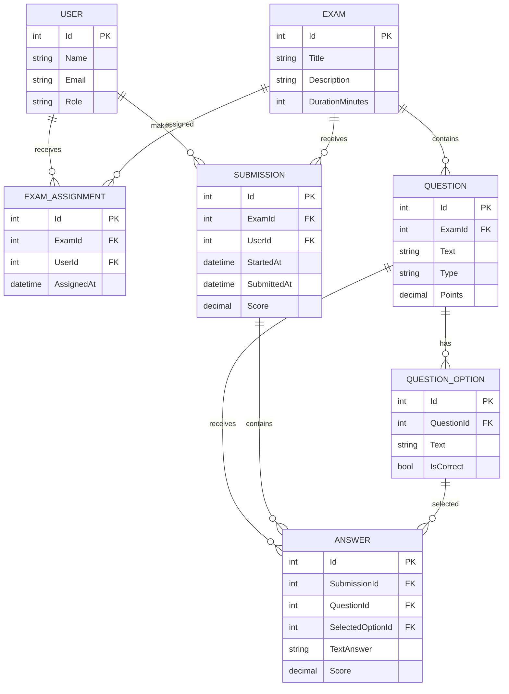

# Diagrama Entidad-Relación

```mermaid
erDiagram
    USER ||--o{ EXAM_ASSIGNMENT : receives
    USER ||--o{ SUBMISSION : makes

    EXAM ||--o{ QUESTION : contains
    EXAM ||--o{ EXAM_ASSIGNMENT : assigned
    EXAM ||--o{ SUBMISSION : receives

    QUESTION ||--o{ QUESTION_OPTION : has
    QUESTION ||--o{ ANSWER : receives

    SUBMISSION ||--o{ ANSWER : contains

    QUESTION_OPTION ||--o{ ANSWER : selected

    USER {
        int Id PK
        string Name
        string Email
        string Role
    }

    EXAM {
        int Id PK
        string Title
        string Description
        int DurationMinutes
    }

    QUESTION {
        int Id PK
        int ExamId FK
        string Text
        string Type
        decimal Points
    }

    QUESTION_OPTION {
        int Id PK
        int QuestionId FK
        string Text
        bool IsCorrect
    }

    EXAM_ASSIGNMENT {
        int Id PK
        int ExamId FK
        int UserId FK
        datetime AssignedAt
    }

    SUBMISSION {
        int Id PK
        int ExamId FK
        int UserId FK
        datetime StartedAt
        datetime SubmittedAt
        decimal Score
    }

    ANSWER {
        int Id PK
        int SubmissionId FK
        int QuestionId FK
        int SelectedOptionId FK
        string TextAnswer
        decimal Score
    }
```